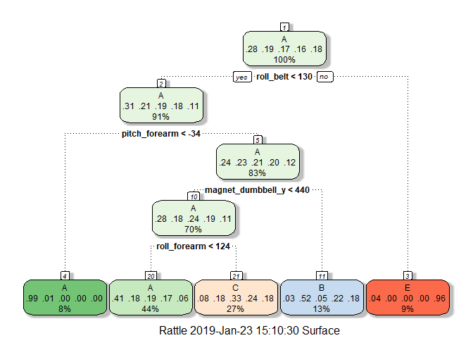
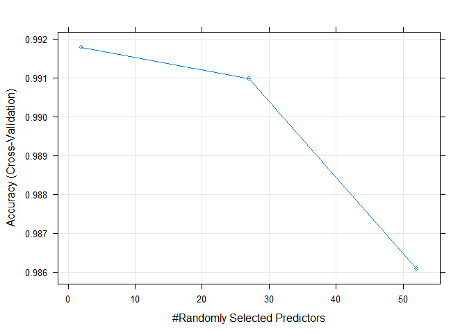
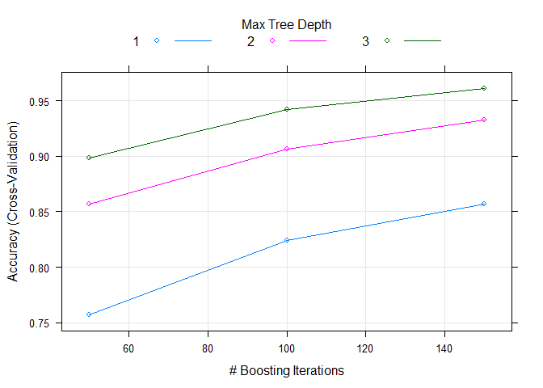

***

## Background

Using devices such as Jawbone Up, Nike FuelBand, and Fitbit it is now possible to collect a large amount of data about personal activity relatively inexpensively. These type of devices are part of the quantified self movement - a group of enthusiasts who take measurements about themselves regularly to improve their health, to find patterns in their behavior, or because they are tech geeks. One thing that people regularly do is quantify how much of a particular activity they do, but they rarely quantify how well they do it. In this project, your goal will be to use data from accelerometers on the belt, forearm, arm, and dumbell of 6 participants. They were asked to perform barbell lifts correctly and incorrectly in 5 different ways. More information is available from the [website](http://web.archive.org/web/20161224072740/http:/groupware.les.inf.puc-rio.br/har) (see the section on the Weight Lifting Exercise Dataset).

Data: [Training data](https://d396qusza40orc.cloudfront.net/predmachlearn/pml-training.csv) and [Test data](https://d396qusza40orc.cloudfront.net/predmachlearn/pml-testing.csv)


The data for this project come from this [source](http://web.archive.org/web/20161224072740/http:/groupware.les.inf.puc-rio.br/har).  
"Ugulino, W.; Cardador, D.; Vega, K.; Velloso, E.; Milidiu, R.; Fuks, H. Wearable Computing: Accelerometers' Data Classification of Body Postures and Movements"

***

## Data Processing

### Libraries


```r
library(ggplot2)
library(caret)
library(rattle)
library(rpart)
library(randomForest)
library(gbm)
```

### Read data


```r
train.raw = read.csv(".\\Data\\pml-training.csv",header=TRUE)
valid.raw = read.csv(".\\Data\\pml-testing.csv",header=TRUE)
dim(train.raw)
```

```
## [1] 19622   160
```

```r
dim(valid.raw)
```

```
## [1]  20 160
```


```r
str(train.raw)
```

```
## 'data.frame':	19622 obs. of  160 variables:
##  $ X                       : int  1 2 3 4 5 6 7 8 9 10 ...
##  $ user_name               : Factor w/ 6 levels "adelmo","carlitos",..: 2 2 2 2 2 2 2 2 2 2 ...
##  $ raw_timestamp_part_1    : int  1323084231 1323084231 1323084231 1323084232 1323084232 1323084232 1323084232 1323084232 1323084232 1323084232 ...
##  $ raw_timestamp_part_2    : int  788290 808298 820366 120339 196328 304277 368296 440390 484323 484434 ...
##  $ cvtd_timestamp          : Factor w/ 20 levels "02/12/2011 13:32",..: 9 9 9 9 9 9 9 9 9 9 ...
##  $ new_window              : Factor w/ 2 levels "no","yes": 1 1 1 1 1 1 1 1 1 1 ...
##  $ num_window              : int  11 11 11 12 12 12 12 12 12 12 ...
##  $ roll_belt               : num  1.41 1.41 1.42 1.48 1.48 1.45 1.42 1.42 1.43 1.45 ...
##  $ pitch_belt              : num  8.07 8.07 8.07 8.05 8.07 8.06 8.09 8.13 8.16 8.17 ...
##  $ yaw_belt                : num  -94.4 -94.4 -94.4 -94.4 -94.4 -94.4 -94.4 -94.4 -94.4 -94.4 ...
##  $ total_accel_belt        : int  3 3 3 3 3 3 3 3 3 3 ...
##  $ kurtosis_roll_belt      : Factor w/ 397 levels "","-0.016850",..: 1 1 1 1 1 1 1 1 1 1 ...
##  $ kurtosis_picth_belt     : Factor w/ 317 levels "","-0.021887",..: 1 1 1 1 1 1 1 1 1 1 ...
##  $ kurtosis_yaw_belt       : Factor w/ 2 levels "","#DIV/0!": 1 1 1 1 1 1 1 1 1 1 ...
##  $ skewness_roll_belt      : Factor w/ 395 levels "","-0.003095",..: 1 1 1 1 1 1 1 1 1 1 ...
##  $ skewness_roll_belt.1    : Factor w/ 338 levels "","-0.005928",..: 1 1 1 1 1 1 1 1 1 1 ...
##  $ skewness_yaw_belt       : Factor w/ 2 levels "","#DIV/0!": 1 1 1 1 1 1 1 1 1 1 ...
##  $ max_roll_belt           : num  NA NA NA NA NA NA NA NA NA NA ...
##  $ max_picth_belt          : int  NA NA NA NA NA NA NA NA NA NA ...
##  $ max_yaw_belt            : Factor w/ 68 levels "","-0.1","-0.2",..: 1 1 1 1 1 1 1 1 1 1 ...
##  $ min_roll_belt           : num  NA NA NA NA NA NA NA NA NA NA ...
##  $ min_pitch_belt          : int  NA NA NA NA NA NA NA NA NA NA ...
##  $ min_yaw_belt            : Factor w/ 68 levels "","-0.1","-0.2",..: 1 1 1 1 1 1 1 1 1 1 ...
##  $ amplitude_roll_belt     : num  NA NA NA NA NA NA NA NA NA NA ...
##  $ amplitude_pitch_belt    : int  NA NA NA NA NA NA NA NA NA NA ...
##  $ amplitude_yaw_belt      : Factor w/ 4 levels "","#DIV/0!","0.00",..: 1 1 1 1 1 1 1 1 1 1 ...
##  $ var_total_accel_belt    : num  NA NA NA NA NA NA NA NA NA NA ...
##  $ avg_roll_belt           : num  NA NA NA NA NA NA NA NA NA NA ...
##  $ stddev_roll_belt        : num  NA NA NA NA NA NA NA NA NA NA ...
##  $ var_roll_belt           : num  NA NA NA NA NA NA NA NA NA NA ...
##  $ avg_pitch_belt          : num  NA NA NA NA NA NA NA NA NA NA ...
##  $ stddev_pitch_belt       : num  NA NA NA NA NA NA NA NA NA NA ...
##  $ var_pitch_belt          : num  NA NA NA NA NA NA NA NA NA NA ...
##  $ avg_yaw_belt            : num  NA NA NA NA NA NA NA NA NA NA ...
##  $ stddev_yaw_belt         : num  NA NA NA NA NA NA NA NA NA NA ...
##  $ var_yaw_belt            : num  NA NA NA NA NA NA NA NA NA NA ...
##  $ gyros_belt_x            : num  0 0.02 0 0.02 0.02 0.02 0.02 0.02 0.02 0.03 ...
##  $ gyros_belt_y            : num  0 0 0 0 0.02 0 0 0 0 0 ...
##  $ gyros_belt_z            : num  -0.02 -0.02 -0.02 -0.03 -0.02 -0.02 -0.02 -0.02 -0.02 0 ...
##  $ accel_belt_x            : int  -21 -22 -20 -22 -21 -21 -22 -22 -20 -21 ...
##  $ accel_belt_y            : int  4 4 5 3 2 4 3 4 2 4 ...
##  $ accel_belt_z            : int  22 22 23 21 24 21 21 21 24 22 ...
##  $ magnet_belt_x           : int  -3 -7 -2 -6 -6 0 -4 -2 1 -3 ...
##  $ magnet_belt_y           : int  599 608 600 604 600 603 599 603 602 609 ...
##  $ magnet_belt_z           : int  -313 -311 -305 -310 -302 -312 -311 -313 -312 -308 ...
##  $ roll_arm                : num  -128 -128 -128 -128 -128 -128 -128 -128 -128 -128 ...
##  $ pitch_arm               : num  22.5 22.5 22.5 22.1 22.1 22 21.9 21.8 21.7 21.6 ...
##  $ yaw_arm                 : num  -161 -161 -161 -161 -161 -161 -161 -161 -161 -161 ...
##  $ total_accel_arm         : int  34 34 34 34 34 34 34 34 34 34 ...
##  $ var_accel_arm           : num  NA NA NA NA NA NA NA NA NA NA ...
##  $ avg_roll_arm            : num  NA NA NA NA NA NA NA NA NA NA ...
##  $ stddev_roll_arm         : num  NA NA NA NA NA NA NA NA NA NA ...
##  $ var_roll_arm            : num  NA NA NA NA NA NA NA NA NA NA ...
##  $ avg_pitch_arm           : num  NA NA NA NA NA NA NA NA NA NA ...
##  $ stddev_pitch_arm        : num  NA NA NA NA NA NA NA NA NA NA ...
##  $ var_pitch_arm           : num  NA NA NA NA NA NA NA NA NA NA ...
##  $ avg_yaw_arm             : num  NA NA NA NA NA NA NA NA NA NA ...
##  $ stddev_yaw_arm          : num  NA NA NA NA NA NA NA NA NA NA ...
##  $ var_yaw_arm             : num  NA NA NA NA NA NA NA NA NA NA ...
##  $ gyros_arm_x             : num  0 0.02 0.02 0.02 0 0.02 0 0.02 0.02 0.02 ...
##  $ gyros_arm_y             : num  0 -0.02 -0.02 -0.03 -0.03 -0.03 -0.03 -0.02 -0.03 -0.03 ...
##  $ gyros_arm_z             : num  -0.02 -0.02 -0.02 0.02 0 0 0 0 -0.02 -0.02 ...
##  $ accel_arm_x             : int  -288 -290 -289 -289 -289 -289 -289 -289 -288 -288 ...
##  $ accel_arm_y             : int  109 110 110 111 111 111 111 111 109 110 ...
##  $ accel_arm_z             : int  -123 -125 -126 -123 -123 -122 -125 -124 -122 -124 ...
##  $ magnet_arm_x            : int  -368 -369 -368 -372 -374 -369 -373 -372 -369 -376 ...
##  $ magnet_arm_y            : int  337 337 344 344 337 342 336 338 341 334 ...
##  $ magnet_arm_z            : int  516 513 513 512 506 513 509 510 518 516 ...
##  $ kurtosis_roll_arm       : Factor w/ 330 levels "","-0.02438",..: 1 1 1 1 1 1 1 1 1 1 ...
##  $ kurtosis_picth_arm      : Factor w/ 328 levels "","-0.00484",..: 1 1 1 1 1 1 1 1 1 1 ...
##  $ kurtosis_yaw_arm        : Factor w/ 395 levels "","-0.01548",..: 1 1 1 1 1 1 1 1 1 1 ...
##  $ skewness_roll_arm       : Factor w/ 331 levels "","-0.00051",..: 1 1 1 1 1 1 1 1 1 1 ...
##  $ skewness_pitch_arm      : Factor w/ 328 levels "","-0.00184",..: 1 1 1 1 1 1 1 1 1 1 ...
##  $ skewness_yaw_arm        : Factor w/ 395 levels "","-0.00311",..: 1 1 1 1 1 1 1 1 1 1 ...
##  $ max_roll_arm            : num  NA NA NA NA NA NA NA NA NA NA ...
##  $ max_picth_arm           : num  NA NA NA NA NA NA NA NA NA NA ...
##  $ max_yaw_arm             : int  NA NA NA NA NA NA NA NA NA NA ...
##  $ min_roll_arm            : num  NA NA NA NA NA NA NA NA NA NA ...
##  $ min_pitch_arm           : num  NA NA NA NA NA NA NA NA NA NA ...
##  $ min_yaw_arm             : int  NA NA NA NA NA NA NA NA NA NA ...
##  $ amplitude_roll_arm      : num  NA NA NA NA NA NA NA NA NA NA ...
##  $ amplitude_pitch_arm     : num  NA NA NA NA NA NA NA NA NA NA ...
##  $ amplitude_yaw_arm       : int  NA NA NA NA NA NA NA NA NA NA ...
##  $ roll_dumbbell           : num  13.1 13.1 12.9 13.4 13.4 ...
##  $ pitch_dumbbell          : num  -70.5 -70.6 -70.3 -70.4 -70.4 ...
##  $ yaw_dumbbell            : num  -84.9 -84.7 -85.1 -84.9 -84.9 ...
##  $ kurtosis_roll_dumbbell  : Factor w/ 398 levels "","-0.0035","-0.0073",..: 1 1 1 1 1 1 1 1 1 1 ...
##  $ kurtosis_picth_dumbbell : Factor w/ 401 levels "","-0.0163","-0.0233",..: 1 1 1 1 1 1 1 1 1 1 ...
##  $ kurtosis_yaw_dumbbell   : Factor w/ 2 levels "","#DIV/0!": 1 1 1 1 1 1 1 1 1 1 ...
##  $ skewness_roll_dumbbell  : Factor w/ 401 levels "","-0.0082","-0.0096",..: 1 1 1 1 1 1 1 1 1 1 ...
##  $ skewness_pitch_dumbbell : Factor w/ 402 levels "","-0.0053","-0.0084",..: 1 1 1 1 1 1 1 1 1 1 ...
##  $ skewness_yaw_dumbbell   : Factor w/ 2 levels "","#DIV/0!": 1 1 1 1 1 1 1 1 1 1 ...
##  $ max_roll_dumbbell       : num  NA NA NA NA NA NA NA NA NA NA ...
##  $ max_picth_dumbbell      : num  NA NA NA NA NA NA NA NA NA NA ...
##  $ max_yaw_dumbbell        : Factor w/ 73 levels "","-0.1","-0.2",..: 1 1 1 1 1 1 1 1 1 1 ...
##  $ min_roll_dumbbell       : num  NA NA NA NA NA NA NA NA NA NA ...
##  $ min_pitch_dumbbell      : num  NA NA NA NA NA NA NA NA NA NA ...
##  $ min_yaw_dumbbell        : Factor w/ 73 levels "","-0.1","-0.2",..: 1 1 1 1 1 1 1 1 1 1 ...
##  $ amplitude_roll_dumbbell : num  NA NA NA NA NA NA NA NA NA NA ...
##   [list output truncated]
```

### Clean Data  
We will remove the variables that contains missing values and the first seven columns that do not contribute much to the  outcome.

```r
train.clean = train.raw[, colSums(is.na(train.raw)) == 0]
valid.dat = valid.raw[, colSums(is.na(valid.raw)) == 0]
train.clean = train.clean[, -c(1:7)]
valid.dat = valid.dat[, -c(1:7)]
dim(train.clean)
```

```
## [1] 19622    86
```

```r
dim(valid.dat)
```

```
## [1] 20 53
```
Remove the variables that are near-zero-variance

```r
NZV = nearZeroVar(train.clean)
train.clean = train.clean[, -NZV]
dim(train.clean)
```

```
## [1] 19622    53
```

### Prepare Data  
Split `train.clean` into train data (70%) and test data (30%). 

```r
set.seed(12345)
inTrain = createDataPartition(train.clean$classe, p = 0.7, list = FALSE)
train.dat = train.clean[inTrain, ]
test.dat = train.clean[-inTrain, ]
dim(train.dat)
```

```
## [1] 13737    53
```

```r
dim(test.dat)
```

```
## [1] 5885   53
```

### Correlation  
Use findCorrelation function to search for highly correlated predictors

```r
cor = cor(train.dat[, -53])
h.cor = findCorrelation(cor, cutoff=0.75)
names(train.dat)[h.cor]
```

```
##  [1] "accel_belt_z"      "roll_belt"         "accel_belt_y"     
##  [4] "total_accel_belt"  "accel_dumbbell_z"  "accel_belt_x"     
##  [7] "pitch_belt"        "magnet_dumbbell_x" "accel_dumbbell_y" 
## [10] "magnet_dumbbell_y" "accel_arm_x"       "accel_dumbbell_x" 
## [13] "accel_arm_z"       "magnet_arm_y"      "magnet_belt_z"    
## [16] "accel_forearm_y"   "gyros_forearm_y"   "gyros_dumbbell_x" 
## [19] "gyros_dumbbell_z"  "gyros_arm_x"
```

***

## Data Modeling  

In the following sections, we will test 3 different models:  
- Classification tree  
- Random forest  
- Gradient boosting method  

### 1. Train with Classification tree

Estimate

```r
control = trainControl(method="cv", 5)

model.ct = train(classe~., data=train.dat, method="rpart",trControl=control)
fancyRpartPlot(model.ct$finalModel)
```

<!-- -->

Predict

```r
predict.ct = predict(model.ct, newdata=test.dat)
cm.ct = confusionMatrix(predict.ct, test.dat$classe)
cm.ct
```

```
## Confusion Matrix and Statistics
## 
##           Reference
## Prediction    A    B    C    D    E
##          A 1494  470  467  438  141
##          B   21  380   29  184  147
##          C  128  289  530  342  277
##          D    0    0    0    0    0
##          E   31    0    0    0  517
## 
## Overall Statistics
##                                           
##                Accuracy : 0.4963          
##                  95% CI : (0.4835, 0.5092)
##     No Information Rate : 0.2845          
##     P-Value [Acc > NIR] : < 2.2e-16       
##                                           
##                   Kappa : 0.3425          
##  Mcnemar's Test P-Value : NA              
## 
## Statistics by Class:
## 
##                      Class: A Class: B Class: C Class: D Class: E
## Sensitivity            0.8925  0.33363  0.51657   0.0000  0.47782
## Specificity            0.6400  0.91972  0.78679   1.0000  0.99355
## Pos Pred Value         0.4963  0.49934  0.33844      NaN  0.94343
## Neg Pred Value         0.9374  0.85187  0.88516   0.8362  0.89414
## Prevalence             0.2845  0.19354  0.17434   0.1638  0.18386
## Detection Rate         0.2539  0.06457  0.09006   0.0000  0.08785
## Detection Prevalence   0.5115  0.12931  0.26610   0.0000  0.09312
## Balanced Accuracy      0.7662  0.62667  0.65168   0.5000  0.73568
```

Result

```r
re = data.frame(Method = c("CT","RF","GBM"), Accuracy = c(round(cm.ct$overall[[1]],3),"",""))
re
```

```
##   Method Accuracy
## 1     CT    0.496
## 2     RF         
## 3    GBM
```

### 2. Train with Random forest

Estimate

```r
model.rf = train(classe ~ ., data=train.dat, method="rf", trControl=control, verbose=FALSE)
model.rf
```

```
## Random Forest 
## 
## 13737 samples
##    52 predictor
##     5 classes: 'A', 'B', 'C', 'D', 'E' 
## 
## No pre-processing
## Resampling: Cross-Validated (5 fold) 
## Summary of sample sizes: 10989, 10990, 10990, 10989, 10990 
## Resampling results across tuning parameters:
## 
##   mtry  Accuracy   Kappa    
##    2    0.9917742  0.9895937
##   27    0.9909734  0.9885812
##   52    0.9860961  0.9824117
## 
## Accuracy was used to select the optimal model using the largest value.
## The final value used for the model was mtry = 2.
```


```r
model.rf$finalModel
```

```
## 
## Call:
##  randomForest(x = x, y = y, mtry = param$mtry, verbose = FALSE) 
##                Type of random forest: classification
##                      Number of trees: 500
## No. of variables tried at each split: 2
## 
##         OOB estimate of  error rate: 0.64%
## Confusion matrix:
##      A    B    C    D    E class.error
## A 3901    4    1    0    0 0.001280082
## B   17 2636    5    0    0 0.008276900
## C    0   23 2372    1    0 0.010016694
## D    0    0   32 2218    2 0.015097691
## E    0    0    0    3 2522 0.001188119
```


```r
plot(model.rf)
```

<!-- -->

Predict

```r
predict.rf = predict(model.rf, newdata=test.dat)
cm.rf = confusionMatrix(predict.rf, test.dat$classe)
cm.rf
```

```
## Confusion Matrix and Statistics
## 
##           Reference
## Prediction    A    B    C    D    E
##          A 1673   12    0    0    0
##          B    1 1121   18    0    0
##          C    0    6 1005   24    0
##          D    0    0    3  940    3
##          E    0    0    0    0 1079
## 
## Overall Statistics
##                                           
##                Accuracy : 0.9886          
##                  95% CI : (0.9856, 0.9912)
##     No Information Rate : 0.2845          
##     P-Value [Acc > NIR] : < 2.2e-16       
##                                           
##                   Kappa : 0.9856          
##  Mcnemar's Test P-Value : NA              
## 
## Statistics by Class:
## 
##                      Class: A Class: B Class: C Class: D Class: E
## Sensitivity            0.9994   0.9842   0.9795   0.9751   0.9972
## Specificity            0.9972   0.9960   0.9938   0.9988   1.0000
## Pos Pred Value         0.9929   0.9833   0.9710   0.9937   1.0000
## Neg Pred Value         0.9998   0.9962   0.9957   0.9951   0.9994
## Prevalence             0.2845   0.1935   0.1743   0.1638   0.1839
## Detection Rate         0.2843   0.1905   0.1708   0.1597   0.1833
## Detection Prevalence   0.2863   0.1937   0.1759   0.1607   0.1833
## Balanced Accuracy      0.9983   0.9901   0.9867   0.9869   0.9986
```

Result

```r
re = data.frame(Method = c("CT","RF","GBM"), Accuracy = c(round(cm.ct$overall[[1]],3),round(cm.rf$overall[[1]],3),""))
re
```

```
##   Method Accuracy
## 1     CT    0.496
## 2     RF    0.989
## 3    GBM
```

### 3. Train with Gradient boosting method

Estimte

```r
model.gbm  = train(classe ~ ., data=train.dat, method = "gbm", trControl = control, verbose=FALSE)
model.gbm
```

```
## Stochastic Gradient Boosting 
## 
## 13737 samples
##    52 predictor
##     5 classes: 'A', 'B', 'C', 'D', 'E' 
## 
## No pre-processing
## Resampling: Cross-Validated (5 fold) 
## Summary of sample sizes: 10990, 10989, 10988, 10990, 10991 
## Resampling results across tuning parameters:
## 
##   interaction.depth  n.trees  Accuracy   Kappa    
##   1                   50      0.7569334  0.6917125
##   1                  100      0.8241253  0.7773848
##   1                  150      0.8568123  0.8188032
##   2                   50      0.8566658  0.8183658
##   2                  100      0.9063854  0.8815112
##   2                  150      0.9323002  0.9143297
##   3                   50      0.8981594  0.8710576
##   3                  100      0.9419819  0.9265826
##   3                  150      0.9611996  0.9509080
## 
## Tuning parameter 'shrinkage' was held constant at a value of 0.1
## 
## Tuning parameter 'n.minobsinnode' was held constant at a value of 10
## Accuracy was used to select the optimal model using the largest value.
## The final values used for the model were n.trees = 150,
##  interaction.depth = 3, shrinkage = 0.1 and n.minobsinnode = 10.
```


```r
model.gbm$finalModel
```

```
## A gradient boosted model with multinomial loss function.
## 150 iterations were performed.
## There were 52 predictors of which 52 had non-zero influence.
```


```r
plot(model.gbm)
```

<!-- -->

Predict

```r
predict.gbm = predict(model.gbm, newdata=test.dat)
cm.gbm = confusionMatrix(predict.gbm, test.dat$classe)
cm.gbm
```

```
## Confusion Matrix and Statistics
## 
##           Reference
## Prediction    A    B    C    D    E
##          A 1651   34    0    1    2
##          B   16 1073   33    3   21
##          C    4   32  975   36    9
##          D    3    0   17  915   18
##          E    0    0    1    9 1032
## 
## Overall Statistics
##                                          
##                Accuracy : 0.9594         
##                  95% CI : (0.954, 0.9643)
##     No Information Rate : 0.2845         
##     P-Value [Acc > NIR] : < 2.2e-16      
##                                          
##                   Kappa : 0.9486         
##  Mcnemar's Test P-Value : 5.502e-08      
## 
## Statistics by Class:
## 
##                      Class: A Class: B Class: C Class: D Class: E
## Sensitivity            0.9863   0.9421   0.9503   0.9492   0.9538
## Specificity            0.9912   0.9846   0.9833   0.9923   0.9979
## Pos Pred Value         0.9781   0.9363   0.9233   0.9601   0.9904
## Neg Pred Value         0.9945   0.9861   0.9894   0.9901   0.9897
## Prevalence             0.2845   0.1935   0.1743   0.1638   0.1839
## Detection Rate         0.2805   0.1823   0.1657   0.1555   0.1754
## Detection Prevalence   0.2868   0.1947   0.1794   0.1619   0.1771
## Balanced Accuracy      0.9887   0.9633   0.9668   0.9707   0.9759
```

### Train Result
The result show that Random forest is the best method compared by the accuracy rate values.

```r
re = data.frame(Method = c("CT","RF","GBM"), Accuracy = c(round(cm.ct$overall[[1]],3),round(cm.rf$overall[[1]],3),round(cm.gbm$overall[[1]],3)))
re
```

```
##   Method Accuracy
## 1     CT    0.496
## 2     RF    0.989
## 3    GBM    0.959
```

***

## Conclusion
> Apply Random forest model to the validation data.


```r
re.final = predict(model.rf, newdata=valid.dat)
re.final
```

```
##  [1] B A B A A E D B A A B C B A E E A B B B
## Levels: A B C D E
```
